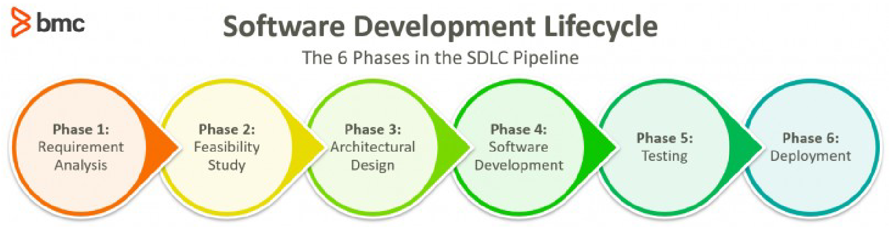

# Introduzione
- Proprietà di sicurezza (CIA):
    - Confidentiality: riservatezza
    - Integrity: integrità
    - Availability: disponibilità

- Meccanismi di sicurezza:
    - Prevenzione (prevention): l’attacco deve fallire
    - Rilevazione (detection): l’attacco potrebbe avere successo ma deve essere notato e riportato
    - Reazione (response): l’attacco rilevato viene mitigato per ridurre la gravità o l’estensione del danno
    - Ripristino (recovery): le conseguenze dell’attacco vengono

# Offensive Security
## Offensive security I, Reconnaissance and Assessment
- Risk Assessment: Analisi del sistema informativo di un'azienda finalizzata a trovare vulnerabilità
- Reconnaissance: Raccolta di informazioni utili, capisco dove posso attaccare
- Enumeration: Delimito il perimetro, rendo il test più efficace
- OSINT: Open Source INTelligence
    - Uso di fonti pubbliche per ricavare informazioni su uno specifico obiettivo
- IANA: Internet Assigned Numbers Authority, assegna gli IP e la concessione dei Top Level Domains (DNS)
    - I record DNS possono svelare: IP, Collovazione di server, Esistenza di sottoreti, ecc
- RIR: Reginal Internet Registry
- LIR: Local Internet Registry

## Attacchi al processo di autenticazione e autorizzazione
La regola AAA:
- Autenticazione: attribuzione certa dell’identità di un soggetto che utilizza le risorse
- Autorizzazione: verifica dei diritti di un soggetto di compiere una determinata azione su di un oggetto
- Auditing: tracciamento affidabile delle decisioni (tutte) di autenticazione e autorizzazione

- Gli attacchi possono avvenire:
    - Violando i metodi di Autenticazione (password)
    - Violando i metodi di Autorizzazione (permessi, elevazione di privilegi, aggiramento dei meccanismi)
- E devono tenere conto dei meccanisimi di auditing

Autenticazione basata su uno o più di questi fattori, qualcosa che solo l'utente:
- Conosce (password)
- Possiede (Yubikey)
- È fisicamente (Impronta digitale)
- È posizione (GPS)

Prover = P, Verifier = V

### Autenticazione passiva
- P e V concordano il segreto e lo memorizzano
- P invia il segreto a V per dimostrare di conoscerlo
- V lo confronta con la sua copia e autentica P

- Problema di comunicazione, servono protocolli più sofisticati

### Memorizzazione delle password
Requisiti:
- V non deve conoscere la password
- Il furto deve essere inefficace
- V deve discriminare le password corrette

Si memoriza una impronta della password, come checksum o hash (funzione one way)

Attacchi con dizionario o password uguali mitigate dall'uso del salt

### Autorizzazione nei sistemi Linux
L'autorizzazione in Linux si basa sull'uso dei gruppi, così da dare a tutti il minimo privilegio necessario (account locked)
- no accesso interattivo
- sì proprietario di processi

#### Bit di autorizzazione per file (e directory)
> Set di 12 bit per i permessi \
> SUID, SGID, STICKY, RWX for User, RWX for Group, RWX for Other

- R = read (lettura del contenuto)
    - Lettura di un file
    - Elenco dei file nella directory
- W = write (modifica del contenuto)
    - Scrittura dentro un file
    - Aggiunta/cancellazione/rinomina di file in una directory
- X = execute
    - Esegui il file come programma
    - Esegui il lookup dell’i-node nella directory

Prima vengono controllati i permessi dell'utente, poi quelli del gruppo

#### Permessi predefiniti
- Ownership: l'utente creatore è il proprietario del file, il gruppo *attivo* dell'utente è assegnato come gruppo proprietario
- Permessi: tutti quelli sensati tolta la *umask* (bitmask che "spegne" i bit non voluti)

- SUID: l'esecuzione del file viene fatta come se fosse lo user proprietario del file ad eseguirlo
- SGID: uguale ma con il gruppo, per le directory l'utente assume come gruppo attivo il gruppo proprietario delle directory
- Sticky bit: suggerisce all'OS di tenere in cache una copia del programma per i file, per le directory riguarda le directory temporanee, ovvero le world writable, con questo bit viene bloccata la cancellazione dei file al loro interno

Per trovare i fiel con SUID e SGUID attivo si può usare `find / -type f -perm /6000`

#### Attributi
Utili per il file system tuning, `chattr` per modificarli `lsattr` per visualizzarli

#### POSIX ACL
> Specificano una lista arbitraria di utenti e gruppi con relativi permessi in aggiunta agli owner

`setfacl` per impostare, `getfacl` per visualizzare le ACL (`ls -l` mostra un `+` dopo i permessi se ACL è presente per un file)

#### Capabilities
> Poteri che possono essere dati ad un utente

Possibile assegnare specifiche capability a processi lanciati da utenti standard

Oggi vengono usate sia le Capabilities che le ACL in Linux

### Bombe Logiche
> Processi con privilegi di amministrazione che possono essere sfruttati per fare danni

#### `cron`
> `crond` è un demone che si occupa di eseguire certi script ogni ora/giorno/settimana/ecc

Se riusciamo ad inserire nostro codice in uno degli script lanciati possiamo fare ciò che vogliamo

#### `at`
> `atd` è un demone che si occupa di eseguire un comando dopo una certa quantità di tempo

## Applicazioni Web
Vulnerabilità:
- Client side
- Protocollo
- Server side

### OWASP
> The Open Web Application Security Project (OWASP) is a nonprofit foundation that works to improve the security of software.

Stila una classifica sulle vulnerabilità più frequenti

#### A1 - Broken access control
> Raggruppa varie cause di accesso non correttamente mediato da risorse

- IDOR: Insecure Direct Object Reference
    - Accesso ad oggetti tramite modifica di un link
- FD: File Disclosure
    - Path traversal

#### A2 - Cryptographic failures
I dati vanno protetti *at rest* e *in transit*, non sempre sono cifrati correttamente (es. nei log)

#### A3 - Injection
> Invio di input non fidati ad un interprete, possibile impatto molto elevato

- SQL Injection
- Cross-Site Scripting (XSS): Iniezione di codice lato browser
    - Reflected: Inserisco in un parametro della query uno script javascript
    - DOM: Iniezione di codice lato browser, modifico il DOM
    - Stored: Iniezione di codice malevolo, che spedisce all'attaccante dati nel tempo
- Pentesting
    - White box
    - Black box
    - Blind Injection (estrazione die dati)

#### A4 - Insecure design
> Metodi di progetto formalizzati per la sicurezza, paradigma *shift left*

Spostare a sinistra la fase in cui si fa attenzione alla sicurezza

#### A5 - Security misconfiguration
> Errori di configurazione a tutti i livelli dello stack

- Server
    - Es. Credenziali di default
    - Es. Uso di XML, nativamente permette riferimenti a risorse esterne
- Protocollo
    - Es. Scelta di cifrari deboli per TLS
    - Es. HTTP e non HTTPS
- Client
    - Es. Header lato server errati
        - `X-Frame-Options`
            - Controlla l’embedding di risorse con `<frame>`, `<iframe>`, `<object>`
            - `DENY, SAMEORIGIN, ALLOW-FROM <url>`
        - `X-XSS-Protection`
            - filtra i tentativi di reflected Cross Site Scripting (v. A3)
            - `1 ; mode=block`
        - `Content-Security-Policy`
            - previene il caricamento di risorse (es. js) da origini esterne
            - `default-src 'self'`
    - Es. Compatibilità browser
    - Es. Uso di XML, nativamente permette riferimenti a risorse esterne

Soluzioni:
- Soluzione draastica: Same Origin Polici (SOP)
    - Troppo limitante
- Cross-Origin Resource Sharing (CORS)
    - Rilassa in modo controllato i vincoli SOP, gestendo alcune eccezioni
